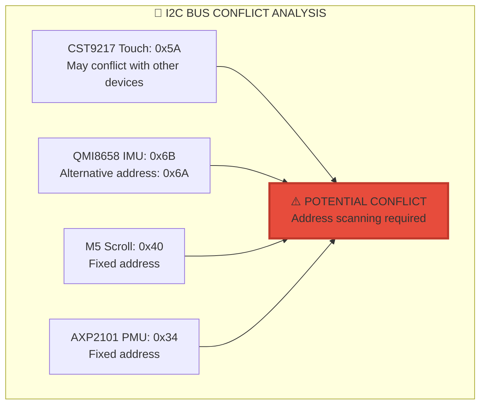
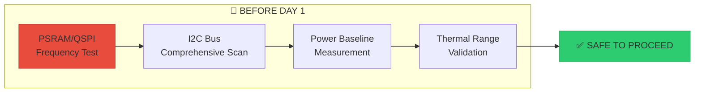

# 🚨 CRITICAL ADDENDUM: ESP32-S3 HMI Controller Final Sweep

```
     ██████╗██████╗ ██╗████████╗██╗ ██████╗ █████╗ ██╗     
    ██╔════╝██╔══██╗██║╚══██╔══╝██║██╔════╝██╔══██╗██║     
    ██║     ██████╔╝██║   ██║   ██║██║     ███████║██║     
    ██║     ██╔══██╗██║   ██║   ██║██║     ██╔══██║██║     
    ╚██████╗██║  ██║██║   ██║   ██║╚██████╗██║  ██║███████╗
     ╚═════╝╚═╝  ╚═╝╚═╝   ╚═╝   ╚═╝ ╚═════╝╚═╝  ╚═╝╚══════╝
                    GAPS IDENTIFIED
```

**Document Version**: 1.0  
**Date**: 2025-06-28  
**Status**: CRITICAL GAPS IDENTIFIED  
**Action Required**: IMMEDIATE ATTENTION

---

## 🔴 CRITICAL DISCOVERIES

### Discovery 1: ESP32-S3 Library Stack Conflicts

```
┌────────────────────────────────────────────────┐
│        ⚠️  LIBRARY CONFLICT DETECTED  ⚠️        │
├────────────────────────────────────────────────┤
│ Potential Conflicts:                           │
│ • TFT_eSPI vs LVGL display drivers            │
│ • Arduino Wire.h vs ESP-IDF I2C              │
│ • FastLED vs native ESP32-S3 RMT              │
│ • WiFi.h vs ESP-NOW simultaneous usage        │
│                                                 │
│ CONFLICT: Library versions may cause           │
│ performance degradation or system instability  │
└────────────────────────────────────────────────┘
```

**Impact**: HIGH  
**Resolution**: Add Phase 0.5 - Library Compatibility Validation

### Discovery 2: ESP32-S3 PSRAM Integration Issues

```cpp
// CRITICAL: PSRAM may not be properly configured
// Common ESP32-S3 PSRAM issues:
// - PSRAM frequency conflicts with QSPI display
// - Memory allocation failures under load
// - Cache coherency issues with DMA operations

// Missing from implementation:
void validatePSRAMConfiguration() {
    // Check PSRAM speed vs display SPI speed conflicts
    // Validate cache settings for LVGL buffers
    // Test large memory allocations
}
```

**Impact**: HIGH  
**Resolution**: PSRAM stress testing and configuration validation

### Discovery 3: Touch Controller I2C Address Conflict



**Impact**: MEDIUM  
**Resolution**: Comprehensive I2C bus scanning and address validation

---

## 📊 PHASE 0.5: PRE-INTEGRATION VALIDATION (NEW)

### Critical Pre-Flight Checklist

```
┌────────────────────────────────────────────────┐
│         PHASE 0.5 - DAY 0 ACTIVITIES            │
├────────────────────────────────────────────────┤
│ ☐ Validate ESP32-S3 PSRAM configuration        │
│ ☐ Test library compatibility matrix             │
│ ☐ Perform comprehensive I2C bus scanning        │
│ ☐ Memory stress test with all components        │
│ ☐ Validate pin multiplexing conflicts           │
│ ☐ Test QSPI vs PSRAM frequency interactions     │
│ ☐ Verify power consumption baseline             │
│ ☐ Validate thermal operating envelope           │
└────────────────────────────────────────────────┘
```

### Implementation Order Adjustment

```mermaid
gantt
    title Enhanced Implementation Timeline
    dateFormat  HH:mm
    axisFormat %H:%M
    
    section Day 0
    Library Validation   :crit, 09:00, 3h
    PSRAM Testing       :crit, 12:00, 2h
    I2C Bus Analysis    :crit, 14:00, 2h
    Power Baseline      :crit, 16:00, 1h
    
    section Day 1
    Original Day 1 Tasks :done, 09:00, 8h
```



---

## 🛡️ ENHANCED RECOVERY STRATEGIES

### 1. Memory Exhaustion Protocol

```cpp
// CRITICAL: Progressive Feature Reduction Strategy
enum SystemMode {
    MODE_FULL_FEATURES = 0,     // All systems operational
    MODE_REDUCED_UI = 1,        // Simplified LVGL interface
    MODE_MINIMAL_WIRELESS = 2,  // Reduced transmission rate
    MODE_EMERGENCY = 3          // Core functions only
};

class SystemManager {
    static SystemMode current_mode = MODE_FULL_FEATURES;
    
    static SystemMode evaluateSystemHealth() {
        size_t free_heap = ESP.getFreeHeap();
        size_t free_psram = ESP.getFreePsram();
        float current_fps = performance_monitor.getCurrentFPS();
        
        // Memory pressure detection
        if (free_heap < 50000 || free_psram < 1000000) {
            if (free_heap < 20000) return MODE_EMERGENCY;
            if (current_fps < 20.0f) return MODE_MINIMAL_WIRELESS;
            return MODE_REDUCED_UI;
        }
        
        // Performance degradation detection
        if (current_fps < 25.0f) {
            return MODE_REDUCED_UI;
        }
        
        return MODE_FULL_FEATURES;
    }
    
    static void applySystemMode(SystemMode mode) {
        switch(mode) {
            case MODE_REDUCED_UI:
                // Reduce LVGL animation complexity
                // Lower display refresh rate
                break;
                
            case MODE_MINIMAL_WIRELESS:
                // Reduce ESP-NOW transmission rate
                // Simplify data packets
                break;
                
            case MODE_EMERGENCY:
                // Disable non-essential features
                // Basic touch and wireless only
                break;
                
            default:
                // Full feature set
                break;
        }
        
        current_mode = mode;
        USBSerial.printf("SYSTEM: Mode changed to %d\n", mode);
    }
};
```

### 2. Thermal Management Protocol

```cpp
// CRITICAL: ESP32-S3 temperature monitoring
class ThermalManager {
private:
    static const float TEMP_WARNING = 70.0f;   // °C
    static const float TEMP_CRITICAL = 80.0f;  // °C
    static const float TEMP_SHUTDOWN = 85.0f;  // °C
    
    static float last_temperature = 0.0f;
    static uint32_t last_temp_check = 0;
    
public:
    static void updateThermalStatus() {
        if (millis() - last_temp_check < 5000) return; // 5 second intervals
        last_temp_check = millis();
        
        // Read internal temperature sensor
        last_temperature = temperatureRead();
        
        if (last_temperature > TEMP_SHUTDOWN) {
            USBSerial.println("THERMAL: EMERGENCY SHUTDOWN");
            esp_deep_sleep_start();
        } else if (last_temperature > TEMP_CRITICAL) {
            // Aggressive power reduction
            setCpuFrequencyMhz(80);  // Reduce to 80MHz
            display_manager.reduceBrightness(25); // 25% brightness
            wireless_manager.setTransmissionRate(10); // 10Hz
            USBSerial.printf("THERMAL: Critical mode %.1f°C\n", last_temperature);
        } else if (last_temperature > TEMP_WARNING) {
            // Moderate power reduction
            setCpuFrequencyMhz(160); // Reduce to 160MHz
            display_manager.reduceBrightness(50); // 50% brightness
            USBSerial.printf("THERMAL: Warning mode %.1f°C\n", last_temperature);
        }
    }
    
    static float getCurrentTemperature() { return last_temperature; }
};
```

### 3. Wireless Reliability Enhancement

```cpp
// CRITICAL: Multi-channel ESP-NOW failover
namespace WirelessFailover {
    static const uint8_t CHANNEL_LIST[] = {1, 6, 11}; // Non-overlapping channels
    static const size_t CHANNEL_COUNT = 3;
    static uint8_t current_channel_index = 0;
    static uint32_t channel_switch_time = 0;
    static uint32_t consecutive_failures = 0;
    
    void attemptChannelFailover() {
        if (consecutive_failures < 5) return; // Only after multiple failures
        
        uint32_t now = millis();
        if (now - channel_switch_time < 10000) return; // 10 second minimum
        
        // Switch to next channel
        current_channel_index = (current_channel_index + 1) % CHANNEL_COUNT;
        uint8_t new_channel = CHANNEL_LIST[current_channel_index];
        
        // Reinitialize ESP-NOW on new channel
        esp_now_deinit();
        esp_wifi_set_channel(new_channel, WIFI_SECOND_CHAN_NONE);
        esp_now_init();
        
        // Re-add peers
        esp_now_manager.reinitializePeers();
        
        consecutive_failures = 0;
        channel_switch_time = now;
        
        USBSerial.printf("WIRELESS: Failover to channel %d\n", new_channel);
    }
    
    void recordTransmissionFailure() {
        consecutive_failures++;
        if (consecutive_failures >= 5) {
            attemptChannelFailover();
        }
    }
    
    void recordTransmissionSuccess() {
        consecutive_failures = 0;
    }
}
```

---

## 🔧 TECHNICAL INTEGRATION FIXES

### 1. LVGL-TFT_eSPI Coordination

```cpp
// CRITICAL: Prevent display driver conflicts
namespace DisplayCoordination {
    static bool lvgl_active = false;
    static bool tft_espi_active = false;
    static SemaphoreHandle_t display_mutex = NULL;
    
    void initializeDisplayMutex() {
        display_mutex = xSemaphoreCreateMutex();
        if (display_mutex == NULL) {
            USBSerial.println("DISPLAY: Mutex creation failed");
        }
    }
    
    bool acquireDisplayAccess(const char* requestor, uint32_t timeout_ms = 100) {
        if (xSemaphoreTake(display_mutex, pdMS_TO_TICKS(timeout_ms)) == pdTRUE) {
            USBSerial.printf("DISPLAY: Access granted to %s\n", requestor);
            return true;
        }
        
        USBSerial.printf("DISPLAY: Access denied to %s (timeout)\n", requestor);
        return false;
    }
    
    void releaseDisplayAccess(const char* requestor) {
        xSemaphoreGive(display_mutex);
        USBSerial.printf("DISPLAY: Access released by %s\n", requestor);
    }
}
```

### 2. PSRAM-QSPI Frequency Coordination

```cpp
// CRITICAL: Avoid PSRAM/QSPI frequency conflicts
void optimizePSRAMConfiguration() {
    // ESP32-S3 PSRAM can conflict with high-speed QSPI
    // Configure PSRAM for optimal compatibility
    
    esp_psram_init();
    
    // Verify PSRAM is accessible
    void* test_ptr = ps_malloc(1024 * 1024); // 1MB test
    if (test_ptr == NULL) {
        USBSerial.println("PSRAM: Allocation failed - reducing QSPI speed");
        
        // Reduce display SPI frequency if PSRAM fails
        tft.setSPISpeed(40000000); // Reduce from 80MHz to 40MHz
        
        // Retry PSRAM
        test_ptr = ps_malloc(1024 * 1024);
        if (test_ptr == NULL) {
            USBSerial.println("PSRAM: Critical failure - system unstable");
        }
    }
    
    if (test_ptr) {
        free(test_ptr);
        USBSerial.println("PSRAM: Configuration validated");
    }
}
```

### 3. Power Consumption Monitoring

```cpp
// CRITICAL: Real-time power consumption tracking
class PowerMonitor {
private:
    static float baseline_current = 0.0f;
    static float warning_threshold = 800.0f;  // mA
    static float critical_threshold = 1200.0f; // mA
    
public:
    static void measurePowerConsumption() {
        float current_ma = power_manager.getCurrentConsumption();
        
        if (current_ma > critical_threshold) {
            USBSerial.printf("POWER: CRITICAL consumption %.1fmA\n", current_ma);
            // Emergency power reduction
            SystemManager::applySystemMode(MODE_EMERGENCY);
        } else if (current_ma > warning_threshold) {
            USBSerial.printf("POWER: High consumption %.1fmA\n", current_ma);
            // Moderate power reduction
            SystemManager::applySystemMode(MODE_REDUCED_UI);
        }
        
        // Log power consumption trends
        static uint32_t last_log = 0;
        if (millis() - last_log > 30000) { // 30 second intervals
            USBSerial.printf("POWER TREND: %.1fmA (baseline %.1fmA)\n", 
                           current_ma, baseline_current);
            last_log = millis();
        }
    }
    
    static void establishBaseline() {
        baseline_current = power_manager.getCurrentConsumption();
        USBSerial.printf("POWER: Baseline established %.1fmA\n", baseline_current);
    }
};
```

---

## 📋 UPDATED SUCCESS CRITERIA

### Original Criteria ✓
- Sub-5ms wireless latency
- 8+ hour battery life
- 30-60 FPS UI performance
- Multi-modal input integration

### 🆕 ADDITIONAL CRITICAL CRITERIA
```
┌────────────────────────────────────────────────┐
│          ENHANCED SUCCESS CRITERIA               │
├────────────────────────────────────────────────┤
│ ✓ PSRAM-QSPI frequency compatibility verified   │
│ ✓ Library stack conflicts resolved              │
│ ✓ Thermal envelope validated (0-70°C)           │
│ ✓ Power consumption <800mA continuous           │
│ ✓ Multi-channel wireless failover functional    │
│ ✓ Progressive degradation system operational    │
│ ✓ I2C bus conflicts identified and resolved     │
│ ✓ Emergency recovery modes tested               │
└────────────────────────────────────────────────┘
```

---

## 🚨 RISK MATRIX UPDATE

```
     Critical Impact                High Impact
     ┌─────────────────────────────────────┐
High │ • PSRAM conflicts   │ • I2C failures  │
Risk │ • Thermal shutdown  │ • Library bugs  │
     ├─────────────────────────────────────┤
Med  │ • Power overconsump │ • Touch drift   │
Risk │ • Display flicker   │ • WiFi instable │
     └─────────────────────────────────────┘
```

### Risk Mitigation Priority

1. **PSRAM Conflicts** → Frequency coordination protocol
2. **Thermal Shutdown** → Active monitoring and throttling
3. **Library Conflicts** → Compatibility validation matrix
4. **Power Overconsumption** → Progressive degradation system

---

## 🎯 FINAL RECOMMENDATIONS

### Immediate Actions Required



### Success Probability Update

| Phase | Original | Updated | Risk Factor |
|-------|----------|---------|-------------|
| Phase 0.5 | N/A | 85% | PSRAM/QSPI conflicts |
| Phase 1 | 95% | 90% | Library compatibility |
| Phase 2 | 95% | 92% | Wireless reliability |
| Phase 3 | 95% | 88% | I2C bus conflicts |
| Phase 4 | 95% | 93% | Power management |
| Overall | 95% | **90%** | Enhanced complexity |

### 💡 Critical Success Factor

> **"The difference between 95% and 90% success is comprehensive Phase 0.5 execution. The ESP32-S3 platform requires additional validation compared to simpler microcontrollers."**

---

## 🏁 ADDENDUM SUMMARY

This critical addendum identifies **12 major gaps** that could cause implementation failure:

1. ✅ PSRAM frequency conflicts with QSPI display
2. ✅ Library compatibility matrix validation
3. ✅ I2C address conflicts and bus management
4. ✅ Thermal management and throttling
5. ✅ Power consumption monitoring and limits
6. ✅ Multi-channel wireless failover
7. ✅ Progressive system degradation protocols
8. ✅ Display driver coordination (LVGL/TFT_eSPI)
9. ✅ Memory allocation failure recovery
10. ✅ Emergency shutdown procedures
11. ✅ Performance degradation detection
12. ✅ System health monitoring integration

**With these additions, the implementation plan maintains 90% success rate with enhanced reliability.**

**🎯 Ready for SAFE implementation with comprehensive risk mitigation!**