# 🎛️ ESP32-S3 Wireless HMI Controller Surgical Implementation Plan

```
    ██╗  ██╗███╗   ███╗██╗     ██╗    ██╗██╗██████╗ ███████╗██╗     ███████╗███████╗███████╗
    ██║  ██║████╗ ████║██║     ██║    ██║██║██╔══██╗██╔════╝██║     ██╔════╝██╔════╝██╔════╝
    ███████║██╔████╔██║██║     ██║ █╗ ██║██║██████╔╝█████╗  ██║     █████╗  ███████╗███████╗
    ██╔══██║██║╚██╔╝██║██║     ██║███╗██║██║██╔══██╗██╔══╝  ██║     ██╔══╝  ╚════██║╚════██║
    ██║  ██║██║ ╚═╝ ██║██║     ╚███╔███╔╝██║██║  ██║███████╗███████╗███████╗███████║███████║
    ╚═╝  ╚═╝╚═╝     ╚═╝╚═╝      ╚══╝╚══╝ ╚═╝╚═╝  ╚═╝╚══════╝╚══════╝╚══════╝╚══════╝╚══════╝
                              PRECISION WIRELESS CONTROL
```

## 📋 Mission Overview

This surgical implementation plan develops a **next-generation wireless HMI controller** using the ESP32-S3-Touch-AMOLED-1.75 platform with M5 Unit Scroll integration, targeting **sub-5ms wireless latency** and **professional-grade user experience** for dedicated music visualizer control applications.

### 🎯 Mission Objectives

```
┌─────────────────────────────────────────────────┐
│           WIRELESS HMI OBJECTIVES                │
├─────────────────────────────────────────────────┤
│ ✓ Sub-5ms end-to-end wireless latency           │
│ ✓ 8+ hour portable operation capability         │
│ ✓ 466×466 circular UI at 30-60 FPS              │
│ ✓ Multi-modal input fusion (touch+rotary+IMU)   │
│ ✓ Zero audio processing responsibilities         │
│ ✓ 200m reliable wireless range                  │
│ ✓ Professional-grade responsiveness             │
│ ✓ Modular architecture for system integration   │
└─────────────────────────────────────────────────┘
```

---

## 🔍 System Architecture Analysis

### Current State vs Target State

```
┌────────────────────────────────────────────────┐
│          HMI CONTROLLER EVOLUTION                │
├────────────────────────────────────────────────┤
│  Current State            Target State           │
│  ┌─────────────────┐     ┌─────────────────┐   │
│  │ No wireless HMI │     │ ESP32-S3 AMOLED │   │
│  │ Wired control   │     │ Wireless control│   │
│  │ Limited mobility│     │ 200m range     │   │
│  │ Basic interface │     │ Circular UI    │   │
│  │ Single input    │     │ Multi-modal    │   │
│  └─────────────────┘     └─────────────────┘   │
└────────────────────────────────────────────────┘
```

### Hardware Platform Architecture

```mermaid
graph TB
    subgraph "🔌 ESP32-S3 PLATFORM ARCHITECTURE"
        A["ESP32-S3R8<br/>Dual-Core 240MHz<br/>16MB Flash + 8MB PSRAM"]
        B["1.75″ AMOLED Display<br/>466×466 CO5300 Driver<br/>QSPI Interface"]
        C["CST9217 Touch<br/>Multi-Touch Capacitive<br/>I2C Interface"]
        D["QMI8658 IMU<br/>6-Axis Motion<br/>±3° Accuracy"]
        E["M5 Unit Scroll<br/>I2C Address 0x40<br/>12 Pulses/Revolution"]
        F["AXP2101 PMU<br/>Battery Management<br/>3.7V Li-ion"]
        G["ESP-NOW Wireless<br/>2.4GHz Direct P2P<br/>3-5ms Latency"]
        
        A -->|"QSPI 80MHz"| B
        A -->|"I2C 100kHz"| C
        A -->|"I2C 100kHz"| D
        A -->|"I2C 100kHz"| E
        A -->|"I2C 400kHz"| F
        A -->|"2.4GHz Radio"| G
    end
    
    style A fill:#3498db,stroke:#2980b9,stroke-width:3px
    style G fill:#e74c3c,stroke:#c0392b,stroke-width:2px
```



### Multi-Modal Input Fusion


---

## 🏥 Implementation Surgery Plan

### Phase 0: Pre-Surgical Preparation (Day 0)

```mermaid
flowchart TB
    subgraph "🔧 PRE-SURGICAL CHECKLIST"
        A["🎯 Hardware Verification<br/>ESP32-S3 + M5 Scroll"]
        B["📊 Baseline Measurements<br/>Memory + Performance"]
        C["🔍 Pin Mapping Analysis<br/>I2C + QSPI + GPIO"]
        D["💉 Development Environment<br/>Arduino IDE + Libraries"]
        E["✅ Pre-Surgery Complete<br/>Ready for Phase 1"]
    end
    
    A --> B --> C --> D --> E
    
    style A fill:#e74c3c,stroke:#c0392b
    style E fill:#2ecc71,stroke:#27ae60
```



#### 0.1 Hardware Verification Protocol

```cpp
// CRITICAL: Hardware detection sequence
void verifyHardwarePlatform() {
    // ESP32-S3 verification
    if (ESP.getChipModel() != "ESP32-S3") {
        ABORT_SETUP("CRITICAL: ESP32-S3 required");
    }
    
    // Memory verification  
    size_t psram_size = ESP.getPsramSize();
    if (psram_size < 8000000) {
        ABORT_SETUP("CRITICAL: 8MB PSRAM required");
    }
    
    // Flash verification
    size_t flash_size = ESP.getFlashChipSize(); 
    if (flash_size < 16000000) {
        ABORT_SETUP("CRITICAL: 16MB Flash required");
    }
    
    USBSerial.printf("PLATFORM VERIFIED: ESP32-S3R8 %dMB Flash %dMB PSRAM\n",
                     flash_size / 1000000, psram_size / 1000000);
}
```

#### 0.2 Pin Mapping Architecture

```cpp
// CRITICAL: Hardware pin definitions
namespace HMI_PINS {
    // Display Interface (QSPI)
    constexpr uint8_t DISPLAY_CS   = 39;
    constexpr uint8_t DISPLAY_DC   = 40; 
    constexpr uint8_t DISPLAY_RST  = 41;
    constexpr uint8_t DISPLAY_MOSI = 42;
    constexpr uint8_t DISPLAY_SCK  = 43;
    
    // Touch Interface (I2C)
    constexpr uint8_t TOUCH_SDA    = 17;
    constexpr uint8_t TOUCH_SCL    = 18;
    constexpr uint8_t TOUCH_INT    = 16;
    constexpr uint8_t TOUCH_RST    = 15;
    
    // IMU Interface (I2C - shared)
    constexpr uint8_t IMU_SDA      = 17; // Shared with touch
    constexpr uint8_t IMU_SCL      = 18; // Shared with touch
    constexpr uint8_t IMU_INT1     = 8;
    constexpr uint8_t IMU_INT2     = 9;
    
    // M5 Scroll Interface (I2C - shared)
    constexpr uint8_t SCROLL_SDA   = 17; // Shared bus
    constexpr uint8_t SCROLL_SCL   = 18; // Shared bus
    constexpr uint8_t SCROLL_INT   = 10;
    
    // Power Management (I2C)
    constexpr uint8_t PMU_SDA      = 17; // Shared bus
    constexpr uint8_t PMU_SCL      = 18; // Shared bus
    constexpr uint8_t PMU_INT      = 11;
    
    // Status LEDs
    constexpr uint8_t STATUS_LED   = 48;
    constexpr uint8_t ERROR_LED    = 47;
}
```

### Phase 1: Display and Touch Foundation (Days 1-2)


#### 1.1 AMOLED Display Initialization

```cpp
// CRITICAL: Display initialization sequence
class AMOLEDManager {
private:
    TFT_eSPI tft;
    static const uint16_t DISPLAY_WIDTH = 466;
    static const uint16_t DISPLAY_HEIGHT = 466;
    static const uint32_t QSPI_FREQ = 80000000; // 80MHz max
    
public:
    bool initializeDisplay() {
        // Power sequence timing CRITICAL
        pinMode(HMI_PINS::DISPLAY_RST, OUTPUT);
        digitalWrite(HMI_PINS::DISPLAY_RST, LOW);
        delay(10);  // EXACTLY 10ms minimum
        digitalWrite(HMI_PINS::DISPLAY_RST, HIGH);
        delay(50);  // EXACTLY 50ms stabilization
        
        // Configure QSPI interface
        tft.init();
        tft.setRotation(0);  // Portrait orientation
        tft.fillScreen(TFT_BLACK);
        
        // Performance optimization
        tft.setSwapBytes(true);  // Color byte order
        
        // Verify display response
        uint16_t display_id = tft.readID();
        if (display_id == 0x0000 || display_id == 0xFFFF) {
            return false;  // Display communication failed
        }
        
        USBSerial.printf("DISPLAY: CO5300 ID=0x%04X READY\n", display_id);
        return true;
    }
    
    // CRITICAL: Performance monitoring
    void measureDisplayPerformance() {
        uint32_t start_time = micros();
        tft.fillScreen(TFT_RED);
        uint32_t fill_time = micros() - start_time;
        
        start_time = micros();
        tft.drawPixel(233, 233, TFT_WHITE);  // Center pixel
        uint32_t pixel_time = micros() - start_time;
        
        USBSerial.printf("DISPLAY PERF: Fill=%luμs Pixel=%luμs\n", 
                         fill_time, pixel_time);
        
        // Performance thresholds
        if (fill_time > 50000) {  // >50ms is too slow
            USBSerial.println("WARNING: Display fill performance degraded");
        }
    }
};
```

#### 1.2 LVGL Circular UI Integration

```cpp
// CRITICAL: LVGL configuration for circular display
namespace CircularUI {
    static const uint16_t CIRCLE_RADIUS = 210;  // Usable circular area
    static const uint16_t CENTER_X = 233;       // Display center
    static const uint16_t CENTER_Y = 233;
    
    // Buffer management for optimal performance
    static const size_t BUFFER_SIZE = DISPLAY_WIDTH * 10; // 10 lines
    static lv_disp_draw_buf_t draw_buf;
    static lv_color_t buf1[BUFFER_SIZE];
    static lv_color_t buf2[BUFFER_SIZE]; // Dual buffering
    
    void initializeLVGL() {
        lv_init();
        
        // Configure display buffer (DUAL BUFFERING CRITICAL)
        lv_disp_draw_buf_init(&draw_buf, buf1, buf2, BUFFER_SIZE);
        
        // Display driver configuration
        static lv_disp_drv_t disp_drv;
        lv_disp_drv_init(&disp_drv);
        disp_drv.hor_res = DISPLAY_WIDTH;
        disp_drv.ver_res = DISPLAY_HEIGHT;
        disp_drv.flush_cb = displayFlushCallback;
        disp_drv.draw_buf = &draw_buf;
        lv_disp_drv_register(&disp_drv);
        
        // Create circular container
        createCircularContainer();
        
        USBSerial.println("LVGL: Circular UI initialized");
    }
    
    void createCircularContainer() {
        // Main circular container
        lv_obj_t* circle_container = lv_obj_create(lv_scr_act());
        lv_obj_set_size(circle_container, CIRCLE_RADIUS * 2, CIRCLE_RADIUS * 2);
        lv_obj_center(circle_container);
        
        // Apply circular mask
        static lv_draw_mask_radius_param_t mask_param;
        lv_draw_mask_radius_init(&mask_param, &circle_area, CIRCLE_RADIUS, false);
        
        // Gesture zones (5 zones: center + 4 cardinal directions)
        createGestureZones(circle_container);
    }
    
    void createGestureZones(lv_obj_t* parent) {
        // Center zone (primary actions)
        lv_obj_t* center_zone = lv_obj_create(parent);
        lv_obj_set_size(center_zone, 80, 80);
        lv_obj_center(center_zone);
        
        // Cardinal direction zones
        const struct { int16_t x, y; } zone_positions[4] = {
            {0, -70},   // Top
            {70, 0},    // Right  
            {0, 70},    // Bottom
            {-70, 0}    // Left
        };
        
        for (int i = 0; i < 4; i++) {
            lv_obj_t* zone = lv_obj_create(parent);
            lv_obj_set_size(zone, 60, 60);
            lv_obj_set_pos(zone, zone_positions[i].x, zone_positions[i].y);
        }
    }
}
```

#### 1.3 Touch Controller Implementation

```cpp
// CRITICAL: CST9217 touch controller management
class TouchManager {
private:
    static const uint8_t CST9217_ADDRESS = 0x5A;
    static const uint16_t TOUCH_THRESHOLD = 50;    // Minimum movement
    static const uint32_t GESTURE_TIMEOUT = 500;   // 500ms gesture window
    static const uint32_t DEBOUNCE_TIME = 20;      // 20ms debounce
    
    struct TouchPoint {
        uint16_t x, y;
        uint8_t pressure;
        bool valid;
        uint32_t timestamp;
    };
    
    TouchPoint current_touches[5];  // Up to 5 touch points
    uint8_t active_touch_count = 0;
    
public:
    bool initializeTouch() {
        // I2C bus initialization  
        Wire.begin(HMI_PINS::TOUCH_SDA, HMI_PINS::TOUCH_SCL);
        Wire.setClock(100000);  // 100kHz for reliability
        
        // Touch controller reset sequence
        pinMode(HMI_PINS::TOUCH_RST, OUTPUT);
        digitalWrite(HMI_PINS::TOUCH_RST, LOW);
        delay(20);  // CRITICAL: 20ms reset pulse
        digitalWrite(HMI_PINS::TOUCH_RST, HIGH);
        delay(100); // CRITICAL: 100ms startup time
        
        // Verify touch controller presence
        Wire.beginTransmission(CST9217_ADDRESS);
        uint8_t error = Wire.endTransmission();
        
        if (error != 0) {
            USBSerial.printf("TOUCH ERROR: I2C error %d\n", error);
            return false;
        }
        
        // Configure touch sensitivity
        configureTouchSensitivity();
        
        USBSerial.println("TOUCH: CST9217 initialized");
        return true;
    }
    
    void configureTouchSensitivity() {
        // Touch sensitivity registers (CST9217 specific)
        writeRegister(0x80, 0x07);  // Touch threshold
        writeRegister(0x81, 0x05);  // Report rate 
        writeRegister(0x82, 0x08);  // Gain setting
        delay(10);
    }
    
    // CRITICAL: High-frequency touch reading (50Hz target)
    bool readTouchData() {
        static uint32_t last_read = 0;
        if (millis() - last_read < 20) return false; // 50Hz max
        last_read = millis();
        
        // Read touch data registers
        Wire.beginTransmission(CST9217_ADDRESS);
        Wire.write(0x02);  // Touch data start register
        if (Wire.endTransmission() != 0) return false;
        
        // Request touch data (up to 30 bytes for 5 touches)
        Wire.requestFrom(CST9217_ADDRESS, (uint8_t)30);
        if (Wire.available() < 30) return false;
        
        // Parse touch data
        parseTouchData();
        
        return true;
    }
    
private:
    void parseTouchData() {
        uint8_t touch_count = Wire.read() & 0x0F;
        if (touch_count > 5) touch_count = 5;
        
        active_touch_count = touch_count;
        
        for (int i = 0; i < touch_count; i++) {
            uint8_t status = Wire.read();
            uint16_t x = (Wire.read() << 8) | Wire.read();
            uint16_t y = (Wire.read() << 8) | Wire.read(); 
            uint8_t pressure = Wire.read();
            
            current_touches[i].x = x;
            current_touches[i].y = y;
            current_touches[i].pressure = pressure;
            current_touches[i].valid = (status & 0x80) != 0;
            current_touches[i].timestamp = millis();
        }
        
        // Clear remaining touch slots
        for (int i = touch_count; i < 5; i++) {
            current_touches[i].valid = false;
        }
    }
};
```

### Phase 2: Wireless Communication Layer (Days 3-4)


#### 2.1 ESP-NOW Protocol Implementation

```cpp
// CRITICAL: Ultra-low latency wireless implementation
namespace WirelessHMI {
    static const uint8_t RECEIVER_MAC[6] = {0xFF, 0xFF, 0xFF, 0xFF, 0xFF, 0xFF}; // Broadcast
    static const uint16_t MAX_PACKET_SIZE = 250;
    static const uint32_t TRANSMISSION_RATE = 50; // 50Hz target
    
    // CRITICAL: Optimized data structure (36 bytes total)
    struct __attribute__((packed)) HMIControlPacket {
        uint8_t controller_id;          // 1 byte
        uint32_t timestamp_us;          // 4 bytes (microsecond precision)
        
        // Touch data (9 bytes)
        uint16_t touch_x, touch_y;      // 4 bytes
        uint8_t touch_pressure;         // 1 byte
        uint8_t gesture_type;           // 1 byte
        uint8_t active_touches;         // 1 byte
        uint16_t gesture_data;          // 2 bytes (gesture-specific)
        
        // Rotary data (4 bytes) 
        int16_t rotary_position;        // 2 bytes
        int8_t rotary_delta;            // 1 byte
        uint8_t button_state;           // 1 byte (8 button bits)
        
        // IMU data (18 bytes)
        float accel_x, accel_y, accel_z;   // 12 bytes
        float gyro_x, gyro_y, gyro_z;      // 6 bytes (int16_t * 3)
        
        // System status (4 bytes)
        uint8_t battery_level;          // 1 byte
        uint8_t signal_strength;        // 1 byte 
        uint8_t error_flags;            // 1 byte
        uint8_t checksum;               // 1 byte
    };
    
    static_assert(sizeof(HMIControlPacket) == 36, "Packet size must be exactly 36 bytes");
    
    class ESPNOWManager {
    private:
        HMIControlPacket current_packet;
        uint32_t packet_counter = 0;
        uint32_t transmission_errors = 0;
        uint32_t last_transmission = 0;
        
    public:
        bool initializeESPNOW() {
            // Initialize WiFi in STA mode for ESP-NOW
            WiFi.mode(WIFI_STA);
            WiFi.disconnect();
            
            // Initialize ESP-NOW
            if (esp_now_init() != ESP_OK) {
                USBSerial.println("ESP-NOW: Initialization failed");
                return false;
            }
            
            // Register send callback
            esp_now_register_send_cb(onDataSent);
            
            // Add broadcast peer
            esp_now_peer_info_t peerInfo = {};
            memcpy(peerInfo.peer_addr, RECEIVER_MAC, 6);
            peerInfo.channel = 0;
            peerInfo.encrypt = false; // No encryption for minimum latency
            
            if (esp_now_add_peer(&peerInfo) != ESP_OK) {
                USBSerial.println("ESP-NOW: Failed to add peer");
                return false;
            }
            
            USBSerial.println("ESP-NOW: Initialized successfully");
            return true;
        }
        
        // CRITICAL: Ultra-low latency transmission
        bool transmitHMIData(const TouchManager& touch, 
                           const RotaryManager& rotary,
                           const IMUManager& imu,
                           uint8_t battery_level) {
            
            static uint32_t last_transmit = 0;
            uint32_t now = millis();
            
            // Rate limiting to 50Hz
            if (now - last_transmit < 20) return false;
            last_transmit = now;
            
            // Build packet with microsecond precision timestamp
            current_packet.controller_id = 0x01;
            current_packet.timestamp_us = micros();
            
            // Touch data
            if (touch.hasValidTouch()) {
                TouchPoint primary = touch.getPrimaryTouch();
                current_packet.touch_x = primary.x;
                current_packet.touch_y = primary.y;
                current_packet.touch_pressure = primary.pressure;
                current_packet.gesture_type = touch.getCurrentGesture();
                current_packet.active_touches = touch.getActiveTouchCount();
                current_packet.gesture_data = touch.getGestureData();
            } else {
                memset(&current_packet.touch_x, 0, 9);
            }
            
            // Rotary data
            current_packet.rotary_position = rotary.getPosition();
            current_packet.rotary_delta = rotary.getDelta();
            current_packet.button_state = rotary.getButtonState();
            
            // IMU data (compress to int16_t for efficiency)
            IMUData imu_data = imu.getCurrentData();
            current_packet.accel_x = imu_data.accel_x;
            current_packet.accel_y = imu_data.accel_y;
            current_packet.accel_z = imu_data.accel_z;
            current_packet.gyro_x = imu_data.gyro_x * 1000; // Convert to int16_t
            current_packet.gyro_y = imu_data.gyro_y * 1000;
            current_packet.gyro_z = imu_data.gyro_z * 1000;
            
            // System status
            current_packet.battery_level = battery_level;
            current_packet.signal_strength = WiFi.RSSI();
            current_packet.error_flags = getSystemErrorFlags();
            current_packet.checksum = calculateChecksum();
            
            // Transmit with latency measurement
            uint32_t tx_start = micros();
            esp_err_t result = esp_now_send(RECEIVER_MAC, 
                                          (uint8_t*)&current_packet, 
                                          sizeof(current_packet));
            uint32_t tx_time = micros() - tx_start;
            
            if (result == ESP_OK) {
                packet_counter++;
                if (tx_time > 1000) { // >1ms is concerning
                    USBSerial.printf("ESP-NOW: TX time %luμs\n", tx_time);
                }
                return true;
            } else {
                transmission_errors++;
                USBSerial.printf("ESP-NOW: TX failed %d\n", result);
                return false;
            }
        }
        
    private:
        static void onDataSent(const uint8_t *mac_addr, esp_now_send_status_t status) {
            // Minimal callback for latency
            if (status != ESP_NOW_SEND_SUCCESS) {
                // Handle transmission failure
            }
        }
        
        uint8_t calculateChecksum() {
            uint8_t checksum = 0;
            uint8_t* data = (uint8_t*)&current_packet;
            for (int i = 0; i < sizeof(current_packet) - 1; i++) {
                checksum ^= data[i];
            }
            return checksum;
        }
    };
}
```

### Phase 3: M5 Unit Scroll Integration (Day 5)

#### 3.1 M5 Unit Scroll Protocol Implementation

```cpp
// CRITICAL: M5 Unit Scroll precise integration
class RotaryManager {
private:
    static const uint8_t M5SCROLL_ADDRESS = 0x40;
    static const uint8_t ENCODER_COUNT = 8;
    static const uint16_t BUTTON_DEBOUNCE_MS = 50;
    static const uint32_t LED_UPDATE_INTERVAL = 25; // 40Hz LED updates
    
    struct EncoderState {
        int16_t position;
        int8_t delta;
        bool button_pressed;
        bool button_changed;
        uint32_t last_button_time;
        CRGB led_color;
        uint32_t last_activity;
    };
    
    EncoderState encoders[ENCODER_COUNT];
    uint32_t last_read_time = 0;
    uint32_t last_led_update = 0;
    bool device_connected = false;
    
public:
    bool initializeRotary() {
        // I2C already initialized by touch controller
        
        // Test M5 Unit Scroll presence
        Wire.beginTransmission(M5SCROLL_ADDRESS);
        uint8_t error = Wire.endTransmission();
        
        if (error != 0) {
            USBSerial.printf("M5SCROLL: Device not found (error %d)\n", error);
            device_connected = false;
            return false;
        }
        
        // Reset all encoder positions
        for (int i = 0; i < ENCODER_COUNT; i++) {
            resetEncoder(i);
        }
        
        // Initialize LED ring
        initializeLEDs();
        
        device_connected = true;
        USBSerial.println("M5SCROLL: Device initialized");
        return true;
    }
    
    // CRITICAL: High-frequency encoder reading (50Hz)
    bool updateEncoders() {
        if (!device_connected) return false;
        
        static uint32_t last_update = 0;
        if (millis() - last_update < 20) return false; // 50Hz max
        last_update = millis();
        
        bool data_changed = false;
        
        for (int i = 0; i < ENCODER_COUNT; i++) {
            int16_t new_position = readEncoderPosition(i);
            bool button_state = readButtonState(i);
            
            // Calculate delta
            int8_t delta = new_position - encoders[i].position;
            if (delta != 0) {
                encoders[i].position = new_position;
                encoders[i].delta = delta;
                encoders[i].last_activity = millis();
                data_changed = true;
                
                // Update LED for activity
                updateEncoderLED(i, true);
            }
            
            // Process button with debouncing
            if (processButton(i, button_state)) {
                data_changed = true;
            }
        }
        
        // Update LED animations
        updateLEDAnimations();
        
        return data_changed;
    }
    
private:
    int16_t readEncoderPosition(uint8_t encoder_id) {
        Wire.beginTransmission(M5SCROLL_ADDRESS);
        Wire.write(0x10 + encoder_id * 2); // Position register
        if (Wire.endTransmission() != 0) return encoders[encoder_id].position;
        
        Wire.requestFrom(M5SCROLL_ADDRESS, (uint8_t)2);
        if (Wire.available() < 2) return encoders[encoder_id].position;
        
        int16_t position = (Wire.read() << 8) | Wire.read();
        return position;
    }
    
    bool readButtonState(uint8_t encoder_id) {
        Wire.beginTransmission(M5SCROLL_ADDRESS);
        Wire.write(0x20); // Button state register
        if (Wire.endTransmission() != 0) return false;
        
        Wire.requestFrom(M5SCROLL_ADDRESS, (uint8_t)1);
        if (Wire.available() < 1) return false;
        
        uint8_t button_mask = Wire.read();
        return (button_mask & (1 << encoder_id)) != 0;
    }
    
    bool processButton(uint8_t encoder_id, bool current_state) {
        EncoderState& encoder = encoders[encoder_id];
        uint32_t now = millis();
        
        // Debouncing
        if (now - encoder.last_button_time < BUTTON_DEBOUNCE_MS) {
            return false;
        }
        
        if (current_state != encoder.button_pressed) {
            encoder.button_pressed = current_state;
            encoder.button_changed = true;
            encoder.last_button_time = now;
            
            if (current_state) {
                encoder.last_activity = now;
                updateEncoderLED(encoder_id, true);
            }
            
            return true;
        }
        
        return false;
    }
    
    void updateEncoderLED(uint8_t encoder_id, bool active) {
        static const CRGB activity_colors[ENCODER_COUNT] = {
            CRGB::Red,    CRGB::Orange, CRGB::Yellow, CRGB::Green,
            CRGB::Cyan,   CRGB::Blue,   CRGB::Purple, CRGB::Magenta
        };
        
        if (active) {
            encoders[encoder_id].led_color = activity_colors[encoder_id];
        } else {
            // Fade to dim for inactive
            encoders[encoder_id].led_color = CRGB(4, 4, 4);
        }
    }
    
    void updateLEDAnimations() {
        if (millis() - last_led_update < LED_UPDATE_INTERVAL) return;
        last_led_update = millis();
        
        for (int i = 0; i < ENCODER_COUNT; i++) {
            // Check activity timeout (2 seconds)
            bool is_active = (millis() - encoders[i].last_activity) < 2000;
            updateEncoderLED(i, is_active);
            
            // Write LED color to device
            writeLEDColor(i, encoders[i].led_color);
        }
    }
    
    void writeLEDColor(uint8_t encoder_id, CRGB color) {
        Wire.beginTransmission(M5SCROLL_ADDRESS);
        Wire.write(0x30 + encoder_id * 3); // LED register base
        Wire.write(color.r);
        Wire.write(color.g);
        Wire.write(color.b);
        Wire.endTransmission();
    }
};
```

### Phase 4: IMU Motion Integration (Day 6)

#### 4.1 QMI8658 IMU Implementation

```cpp
// CRITICAL: 6-axis IMU for motion-enhanced control
class IMUManager {
private:
    static const uint8_t QMI8658_ADDRESS = 0x6B;
    static const float ACCEL_SCALE = 2.0f / 32768.0f;  // ±2g range
    static const float GYRO_SCALE = 250.0f / 32768.0f; // ±250°/s range
    static const uint32_t SAMPLE_RATE_MS = 10; // 100Hz sampling
    
public:
    struct IMUData {
        float accel_x, accel_y, accel_z;    // g units
        float gyro_x, gyro_y, gyro_z;       // °/s units
        float temperature;                   // °C
        uint32_t timestamp;
        bool valid;
    };
    
private:
    IMUData current_data;
    IMUData filtered_data;
    uint32_t last_read_time = 0;
    bool device_ready = false;
    
    // Simple low-pass filter for noise reduction
    static const float FILTER_ALPHA = 0.1f;
    
public:
    bool initializeIMU() {
        // Reset and configure IMU
        if (!resetIMU()) return false;
        if (!configureIMU()) return false;
        
        // Verify sensor response
        if (!verifyIMU()) return false;
        
        // Initialize filter with first reading
        readRawData();
        filtered_data = current_data;
        
        device_ready = true;
        USBSerial.println("IMU: QMI8658 initialized");
        return true;
    }
    
    // CRITICAL: High-frequency data acquisition (100Hz)
    bool updateIMU() {
        if (!device_ready) return false;
        
        uint32_t now = millis();
        if (now - last_read_time < SAMPLE_RATE_MS) return false;
        last_read_time = now;
        
        if (!readRawData()) return false;
        
        // Apply low-pass filtering
        applyFiltering();
        
        return true;
    }
    
    IMUData getCurrentData() const { return filtered_data; }
    
    // Motion gesture detection
    bool detectTiltGesture(float& tilt_x, float& tilt_y) {
        if (!device_ready) return false;
        
        // Calculate tilt angles from accelerometer
        tilt_x = atan2(filtered_data.accel_y, filtered_data.accel_z) * 180.0f / PI;
        tilt_y = atan2(-filtered_data.accel_x, sqrt(filtered_data.accel_y * filtered_data.accel_y + 
                                                   filtered_data.accel_z * filtered_data.accel_z)) * 180.0f / PI;
        
        // Valid tilt range: ±45°
        return (abs(tilt_x) <= 45.0f && abs(tilt_y) <= 45.0f);
    }
    
    bool detectShakeGesture() {
        static float shake_threshold = 2.5f; // g threshold
        static uint32_t shake_window = 200;  // 200ms window
        static uint32_t last_shake = 0;
        
        float magnitude = sqrt(filtered_data.accel_x * filtered_data.accel_x +
                              filtered_data.accel_y * filtered_data.accel_y + 
                              filtered_data.accel_z * filtered_data.accel_z);
        
        if (magnitude > shake_threshold && millis() - last_shake > shake_window) {
            last_shake = millis();
            return true;
        }
        
        return false;
    }
    
private:
    bool resetIMU() {
        Wire.beginTransmission(QMI8658_ADDRESS);
        Wire.write(0x02); // Reset register
        Wire.write(0x05); // Reset command
        uint8_t error = Wire.endTransmission();
        
        if (error != 0) {
            USBSerial.printf("IMU: Reset failed (error %d)\n", error);
            return false;
        }
        
        delay(50); // Reset delay
        return true;
    }
    
    bool configureIMU() {
        // Configure accelerometer: ±2g, 100Hz
        if (!writeRegister(0x03, 0x0C)) return false; // CTRL2: Accel config
        
        // Configure gyroscope: ±250°/s, 100Hz  
        if (!writeRegister(0x04, 0x0C)) return false; // CTRL3: Gyro config
        
        // Enable accelerometer and gyroscope
        if (!writeRegister(0x02, 0x07)) return false; // CTRL1: Enable sensors
        
        delay(10); // Configuration delay
        return true;
    }
    
    bool verifyIMU() {
        uint8_t who_am_i = readRegister(0x00);
        if (who_am_i != 0x05) { // Expected QMI8658 ID
            USBSerial.printf("IMU: Wrong device ID 0x%02X\n", who_am_i);
            return false;
        }
        return true;
    }
    
    bool readRawData() {
        // Read accelerometer and gyroscope data (12 bytes)
        Wire.beginTransmission(QMI8658_ADDRESS);
        Wire.write(0x35); // Accel data start register
        if (Wire.endTransmission() != 0) return false;
        
        Wire.requestFrom(QMI8658_ADDRESS, (uint8_t)12);
        if (Wire.available() < 12) return false;
        
        // Read accelerometer (6 bytes)
        int16_t accel_raw[3];
        accel_raw[0] = (Wire.read() << 8) | Wire.read();
        accel_raw[1] = (Wire.read() << 8) | Wire.read();
        accel_raw[2] = (Wire.read() << 8) | Wire.read();
        
        // Read gyroscope (6 bytes)
        int16_t gyro_raw[3];
        gyro_raw[0] = (Wire.read() << 8) | Wire.read();
        gyro_raw[1] = (Wire.read() << 8) | Wire.read();
        gyro_raw[2] = (Wire.read() << 8) | Wire.read();
        
        // Convert to physical units
        current_data.accel_x = accel_raw[0] * ACCEL_SCALE;
        current_data.accel_y = accel_raw[1] * ACCEL_SCALE;
        current_data.accel_z = accel_raw[2] * ACCEL_SCALE;
        
        current_data.gyro_x = gyro_raw[0] * GYRO_SCALE;
        current_data.gyro_y = gyro_raw[1] * GYRO_SCALE;
        current_data.gyro_z = gyro_raw[2] * GYRO_SCALE;
        
        current_data.timestamp = millis();
        current_data.valid = true;
        
        return true;
    }
    
    void applyFiltering() {
        // Simple exponential moving average filter
        filtered_data.accel_x = FILTER_ALPHA * current_data.accel_x + (1.0f - FILTER_ALPHA) * filtered_data.accel_x;
        filtered_data.accel_y = FILTER_ALPHA * current_data.accel_y + (1.0f - FILTER_ALPHA) * filtered_data.accel_y;
        filtered_data.accel_z = FILTER_ALPHA * current_data.accel_z + (1.0f - FILTER_ALPHA) * filtered_data.accel_z;
        
        filtered_data.gyro_x = FILTER_ALPHA * current_data.gyro_x + (1.0f - FILTER_ALPHA) * filtered_data.gyro_x;
        filtered_data.gyro_y = FILTER_ALPHA * current_data.gyro_y + (1.0f - FILTER_ALPHA) * filtered_data.gyro_y;
        filtered_data.gyro_z = FILTER_ALPHA * current_data.gyro_z + (1.0f - FILTER_ALPHA) * filtered_data.gyro_z;
        
        filtered_data.timestamp = current_data.timestamp;
        filtered_data.valid = current_data.valid;
    }
    
    bool writeRegister(uint8_t reg, uint8_t value) {
        Wire.beginTransmission(QMI8658_ADDRESS);
        Wire.write(reg);
        Wire.write(value);
        return Wire.endTransmission() == 0;
    }
    
    uint8_t readRegister(uint8_t reg) {
        Wire.beginTransmission(QMI8658_ADDRESS);
        Wire.write(reg);
        if (Wire.endTransmission() != 0) return 0;
        
        Wire.requestFrom(QMI8658_ADDRESS, (uint8_t)1);
        return Wire.available() ? Wire.read() : 0;
    }
};
```

### Phase 5: Power Management and Battery Optimization (Day 7)

#### 5.1 AXP2101 Power Management

```cpp
// CRITICAL: Advanced power management for 8+ hour operation
class PowerManager {
private:
    static const uint8_t AXP2101_ADDRESS = 0x34;
    static const uint32_t BATTERY_READ_INTERVAL = 5000; // 5 second intervals
    static const float BATTERY_VOLTAGE_MIN = 3.0f;      // Cutoff voltage
    static const float BATTERY_VOLTAGE_MAX = 4.2f;      // Full charge
    
    struct BatteryState {
        float voltage;          // V
        float current;          // mA
        uint8_t percentage;     // 0-100%
        float temperature;      // °C
        bool charging;
        bool usb_connected;
        uint32_t last_update;
    };
    
    BatteryState battery_state;
    uint32_t last_battery_read = 0;
    bool low_power_mode = false;
    
public:
    bool initializePowerManager() {
        // Configure AXP2101 power management
        if (!detectAXP2101()) return false;
        if (!configurePowerRails()) return false;
        if (!enableBatteryMonitoring()) return false;
        
        // Initial battery reading
        updateBatteryStatus();
        
        USBSerial.println("POWER: AXP2101 initialized");
        return true;
    }
    
    void updatePowerManagement() {
        uint32_t now = millis();
        
        // Update battery status periodically
        if (now - last_battery_read >= BATTERY_READ_INTERVAL) {
            updateBatteryStatus();
            evaluatePowerMode();
            last_battery_read = now;
        }
        
        // Implement power saving strategies
        if (low_power_mode) {
            applyPowerSavingMeasures();
        }
    }
    
    uint8_t getBatteryPercentage() const { return battery_state.percentage; }
    bool isCharging() const { return battery_state.charging; }
    bool isLowPower() const { return low_power_mode; }
    
    // AMOLED-specific power optimization
    void optimizeDisplayPower() {
        // Reduce brightness in low power mode
        if (low_power_mode) {
            // Implement display brightness reduction
            // Dark theme enforcement
            // Pixel minimization strategies
        }
    }
    
private:
    bool detectAXP2101() {
        Wire.beginTransmission(AXP2101_ADDRESS);
        uint8_t error = Wire.endTransmission();
        
        if (error != 0) {
            USBSerial.printf("POWER: AXP2101 not found (error %d)\n", error);
            return false;
        }
        
        // Verify chip ID
        uint8_t chip_id = readRegister(0x03);
        if (chip_id != 0x4A) {
            USBSerial.printf("POWER: Wrong chip ID 0x%02X\n", chip_id);
            return false;
        }
        
        return true;
    }
    
    bool configurePowerRails() {
        // Configure power output voltages
        writeRegister(0x90, 0x0F); // DCDC1: 3.3V (ESP32-S3)
        writeRegister(0x91, 0x0C); // DCDC2: 1.2V (Core voltage)
        writeRegister(0x92, 0x17); // DCDC3: 3.3V (Peripherals)
        
        // Configure LDO voltages
        writeRegister(0x93, 0x19); // ALDO1: 3.3V (Display)
        writeRegister(0x94, 0x19); // ALDO2: 3.3V (Sensors)
        
        // Enable power outputs
        writeRegister(0x10, 0xFF); // Enable all rails
        
        return true;
    }
    
    bool enableBatteryMonitoring() {
        // Enable battery voltage monitoring
        writeRegister(0x30, 0x80); // Enable battery monitoring
        
        // Configure charging parameters
        writeRegister(0x61, 0x04); // Charge voltage: 4.2V
        writeRegister(0x62, 0x03); // Charge current: 300mA
        
        return true;
    }
    
    void updateBatteryStatus() {
        // Read battery voltage (12-bit ADC)
        uint16_t voltage_raw = (readRegister(0x34) << 4) | (readRegister(0x35) >> 4);
        battery_state.voltage = voltage_raw * 1.1f / 1000.0f; // Convert to V
        
        // Read battery current
        uint16_t current_raw = (readRegister(0x36) << 5) | (readRegister(0x37) >> 3);
        battery_state.current = current_raw * 0.5f; // Convert to mA
        
        // Calculate percentage
        battery_state.percentage = calculateBatteryPercentage(battery_state.voltage);
        
        // Check charging status
        uint8_t power_status = readRegister(0x00);
        battery_state.charging = (power_status & 0x04) != 0;
        battery_state.usb_connected = (power_status & 0x20) != 0;
        
        battery_state.last_update = millis();
        
        USBSerial.printf("BATTERY: %.2fV %d%% %s\n", 
                         battery_state.voltage, 
                         battery_state.percentage,
                         battery_state.charging ? "CHG" : "DISC");
    }
    
    uint8_t calculateBatteryPercentage(float voltage) {
        // Li-ion discharge curve approximation
        if (voltage >= BATTERY_VOLTAGE_MAX) return 100;
        if (voltage <= BATTERY_VOLTAGE_MIN) return 0;
        
        // Simple linear approximation (can be improved with lookup table)
        float percentage = (voltage - BATTERY_VOLTAGE_MIN) / 
                          (BATTERY_VOLTAGE_MAX - BATTERY_VOLTAGE_MIN) * 100.0f;
        
        return (uint8_t)constrain(percentage, 0, 100);
    }
    
    void evaluatePowerMode() {
        // Enter low power mode at 20%
        if (battery_state.percentage <= 20 && !battery_state.charging) {
            if (!low_power_mode) {
                USBSerial.println("POWER: Entering low power mode");
                low_power_mode = true;
            }
        } else if (battery_state.percentage >= 30 || battery_state.charging) {
            if (low_power_mode) {
                USBSerial.println("POWER: Exiting low power mode");
                low_power_mode = false;
            }
        }
    }
    
    void applyPowerSavingMeasures() {
        // Reduce wireless transmission rate
        // Dim display
        // Reduce sensor sampling rates
        // Lower CPU frequency if needed
    }
    
    uint8_t readRegister(uint8_t reg) {
        Wire.beginTransmission(AXP2101_ADDRESS);
        Wire.write(reg);
        if (Wire.endTransmission() != 0) return 0;
        
        Wire.requestFrom(AXP2101_ADDRESS, (uint8_t)1);
        return Wire.available() ? Wire.read() : 0;
    }
    
    bool writeRegister(uint8_t reg, uint8_t value) {
        Wire.beginTransmission(AXP2101_ADDRESS);
        Wire.write(reg);
        Wire.write(value);
        return Wire.endTransmission() == 0;
    }
};
```

---

## 🧪 Testing & Validation Protocol

### Comprehensive Test Matrix

```
┌────────────────────────────────────────────────┐
│           VALIDATION TEST MATRIX                 │
├─────────────────────┬──────────────────────────┤
│ Test Category       │ Requirements              │
├─────────────────────┼──────────────────────────┤
│ Wireless Latency    │ <5ms end-to-end           │
│ Touch Response      │ <50ms gesture recognition │
│ UI Refresh Rate     │ 30-60 FPS sustained       │
│ Battery Life        │ >8 hours continuous       │
│ Wireless Range      │ 200m line-of-sight        │
│ I2C Reliability     │ >99% transaction success  │
│ Memory Usage        │ <80% of available         │
│ Temperature Range   │ 0-50°C operation         │
│ Drop Test           │ 1.2m survival            │
│ 24-Hour Stability   │ Zero crashes              │
└─────────────────────┴──────────────────────────┘
```

### Performance Validation Strategy

```mermaid
flowchart TB
    subgraph "🏁 PERFORMANCE VALIDATION"
        A["Baseline Testing<br/>Individual components"]
        B["Integration Testing<br/>Combined systems"]
        C["Stress Testing<br/>Maximum load scenarios"]
        D["Endurance Testing<br/>24-hour continuous"]
        E["✅ VALIDATION COMPLETE<br/>All metrics achieved"]
    end
    
    A --> B --> C --> D --> E
    
    style A fill:#3498db,stroke:#2980b9
    style C fill:#e74c3c,stroke:#c0392b
    style E fill:#2ecc71,stroke:#27ae60,stroke-width:3px
```



---

## 🚨 Risk Mitigation Strategies

### Risk Assessment Matrix

```
     High Impact                    Low Impact
     ┌─────────────────────────────────────┐
High │ • Wireless Latency  │ • LED Failures  │
Risk │ • Battery Depletion │ • UI Lag        │
     ├─────────────────────────────────────┤
Low  │ • Memory Leaks      │ • Cosmetic      │
Risk │ • I2C Timeouts     │ • Minor Bugs    │
     └─────────────────────────────────────┘
```

### Emergency Recovery Protocols


---

## 📊 Success Metrics Dashboard

### Implementation Progress Tracker

```
┌────────────────────────────────────────────────┐
│         IMPLEMENTATION PROGRESS                  │
├─────────────────────┬──────────────────────────┤
│ Component           │ Progress                  │
├─────────────────────┼──────────────────────────┤
│ Hardware Platform   │ [░░░░░░░░░░] 0%          │
│ Display & Touch     │ [░░░░░░░░░░] 0%          │
│ Wireless Protocol   │ [░░░░░░░░░░] 0%          │
│ Rotary Integration  │ [░░░░░░░░░░] 0%          │
│ IMU Motion Control  │ [░░░░░░░░░░] 0%          │
│ Power Management    │ [░░░░░░░░░░] 0%          │
│ Testing & Polish    │ [░░░░░░░░░░] 0%          │
└─────────────────────┴──────────────────────────┘
```

### Victory Conditions

```mermaid
flowchart LR
    subgraph "🏆 VICTORY CONDITIONS"
        A["✓ Sub-5ms wireless<br/>latency achieved"]
        B["✓ 8+ hour battery<br/>life confirmed"]
        C["✓ 30-60 FPS UI<br/>performance"]
        D["✓ Multi-modal input<br/>fully integrated"]
        E["🎯 MISSION<br/>ACCOMPLISHED"]
    end
    
    A --> E
    B --> E
    C --> E
    D --> E
    
    style E fill:#2ecc71,stroke:#27ae60,stroke-width:4px
```



---

## 🎯 Critical Implementation Details

### Memory Layout Optimization

```
     BEFORE IMPLEMENTATION       AFTER IMPLEMENTATION
  ┌─────────────────┐        ┌─────────────────┐
  │ Free Heap: 8MB  │        │ Free Heap: 6.5MB│
  │ No HMI Code     │   ──▶  │ HMI System: 1.5MB│
  │ Basic ESP32     │        │ - Display Buffers│
  │                 │        │ - Wireless Stack │
  │                 │        │ - Sensor Data    │
  └─────────────────┘        └─────────────────┘
   Unused potential          Professional HMI controller
```

### Performance Preservation Strategy

```cpp
// CRITICAL: Real-time performance monitoring
namespace PerformanceMonitor {
    static uint32_t frame_times[60];
    static uint8_t frame_index = 0;
    static float current_fps = 0.0f;
    
    void measureFrameTime() {
        static uint32_t last_frame = 0;
        uint32_t now = millis();
        
        frame_times[frame_index] = now - last_frame;
        frame_index = (frame_index + 1) % 60;
        
        // Calculate FPS over 60 frames
        uint32_t total_time = 0;
        for (int i = 0; i < 60; i++) {
            total_time += frame_times[i];
        }
        
        current_fps = 60000.0f / total_time;
        last_frame = now;
        
        // Performance degradation alert
        if (current_fps < 30.0f) {
            USBSerial.printf("PERFORMANCE WARNING: FPS=%.1f\n", current_fps);
        }
    }
    
    float getCurrentFPS() { return current_fps; }
}
```

---

## 🗺️ Implementation Timeline

### 8-Day Surgical Schedule

```mermaid
gantt
    title 🏥 ESP32-S3 HMI Controller Timeline
    dateFormat  YYYY-MM-DD
    section Foundation
    Hardware Platform     :crit, day0, 2025-01-01, 1d
    Display & Touch      :crit, day1, 2025-01-02, 2d
    section Communication
    Wireless Protocol    :crit, day3, 2025-01-04, 2d
    section Input Systems
    Rotary Integration   :day5, 2025-01-06, 1d
    IMU Motion Control   :day6, 2025-01-07, 1d
    section Optimization
    Power Management     :day7, 2025-01-08, 1d
    Testing & Polish     :day8, 2025-01-09, 1d
```



---

## 🏁 Final Integration Declaration

```mermaid
flowchart TB
    subgraph "🎛️ HMI CONTROLLER EXCELLENCE"
        A["💭 Philosophy<br/>'Wireless freedom meets<br/>precision control through<br/>surgical implementation.'"]
        
        B["📱 ESP32-S3 PLATFORM"]
        C["🎯 SUB-5MS LATENCY"]
        D["🔋 8+ HOUR OPERATION"]
        E["🎛️ MULTI-MODAL INPUT"]
        
        A --> F["✨ IMPLEMENTATION SUCCESS"]
        B --> F
        C --> F
        D --> F
        E --> F
    end
    
    style A fill:#9b59b6,stroke:#8e44ad
    style F fill:#2ecc71,stroke:#27ae60,stroke-width:3px
```



## 🎯 Mission Summary

This surgical plan provides complete implementation of a professional-grade ESP32-S3 wireless HMI controller with sub-5ms latency, 8+ hour operation, and multi-modal input capabilities. Every component analyzed, every protocol optimized, every user interaction perfected.

### 📋 Mission Parameters

| 🎯 Parameter | 📊 Value |
|-------------|----------|
| **Current State** | No wireless HMI capability |
| **Target State** | Professional wireless controller |
| **Success Metric** | Sub-5ms latency, 8+ hour battery |
| **Timeline** | 8 days to HMI excellence |
| **Risk Level** | MEDIUM (complexity management) |
| **Success Rate** | 95% (with surgical precision) |

### 💬 Implementation Oath

> *"First, achieve sub-5ms latency. Second, ensure 8+ hour operation. Third, delight users with responsive multi-modal control."*

**🚀 Time to implement. Time to innovate. Time to achieve wireless HMI controller excellence! 🎛️**